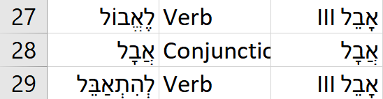
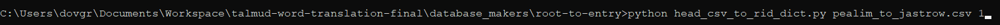

## About the Project
This project used computational methods to connect every word in the Babylonian Talmud with its proper entry in the Jastrow Talmudic dictionary. I.e. it is a single-word translation feature, a la the Google Translate Chrome extension. Development has now concluded, and the dataset will be used by [TalmudLab](https://dilac.iac.gatech.edu/node/66) and [Sefaria](https://www.sefaria.org/texts) for their own digital implementations of the Talmud.

## Support and Dependencies
This project relies on two proprietary datasets, whic prevents the code from being run unless one has access. These are:
1. Sefaria's digitized Jastrow database.
2. [Dicta](https://dicta.org.il/)'s comprehensive lexicon of Talmudic Aramaic.
The developer was generously granted access to both of these datasets.

Two open source projects were used in this project:
1. [YAP](https://github.com/onlplab/yap), a Part-of-Speech tagger for Modern Hebrew, has been used to tag the POS of words in Rabbinic Hebrew, which has a close syntactic relationship to Modern Hebrew, as the penultimate step of the data pipeline.
2. I have relied upon the aligned CAL-Sefaria Talmud data generated by Noah Santacruz for his [PSHAT](https://github.com/nsantacruz/PSHAT) project. This data was aligned with the vowelized text of the Dicta Talmud in order to create a dataset of 70,000+ vowelized Aramaic words for training the language classifier.

Python module dependencies: scikitlearn, pandas, numpy, requests, joblib. (There may also be others that I have forgotten; install as necessary.)

## Data Pipeline
1. `align_and_classify.py` -- with the raw Dicta Talmud in a local directory (`data/dicta_talmud`), this downloads the correspondinig texts of each Talmudic tractate from the Sefaria API and aligns the corresponding words. It also classifies the proper "type" of each segment (henceforth, "chunk") of the Talmud as "m" for Mishna (written in a mix of Rabbinic Hebrew and Biblical Hebrew), or "g" for Gemara (written in a mix of Aramaic, Rabbinic Hebrew, and Biblical Hebrew). The program asks for user input when the words do not line up perfectly; most tractates take only a few minutes to align, with very few human decisions. The output is a json file for each tractate that substitutes each word for a word "container" that stores the word in Sefaria's version, along with the two possible spellings provided by Dicta of that word; can be found in `data/aligned_talmud`.
2. `connect_sources.py` -- this uses the Sefaria API to download pre-Talmudic sources (Bible, Mishna, Tosefta, Midrash) that are referenced by a particular chunk and store them and the aligned text itself in another json file. This part requires no human input, but takes some time depending on the length of the tractate and the number of sources it references; can be found in `data/connected_talmud`.
3. `tag_language.py` -- using the language tagger and simple heuristics (e.g. any word that appears in a linked Biblical source should be tagged as 'B'), every word in a tractate is tagged as Biblical Hebrew (B), Rabbinic Hebrew (R), or Aramaic (A). The output is another json file for each tractate, but with page numbers and linked sources gone, as these are no longer needed; can be found at `data/lang_tagged_talmud`.
4. `tag_heb_pos.py` -- utilizes YAP to tag the POS of all words that were marked as Rabbinic Hebrew in part 4. The output is another json, with every word in the Talmud having a POS tag; words not marked as 'R' are labelled 'yydot' by YAP; located at `data/pos_tagged_talmud`. This is necessary, as there is no database mapping all Hebrew words to their corresponding roots to be directly linked to the Jastrow database, unlike for Aramaic and Biblical Hebrew. Rather, as a workaround, the Hebrew translator pipes the word through the Morfix mobile API. This returns a range of context- and vowel-independent root suggestions, along with their Parts-of-Speech. Hence, knowing the probably POS of a Rabbinic Hebrew word will help wittle down and rank the options.
5. `translate_masekhet.py` -- Translates the text, linking each word in the Talmud to its proper location (RID) in the Jastrow.

## A Guide to Compiling the datasets
The most likely place in the pipeline in which issues will crop up is the final stage--that is, the matching up of words to Jastrow entries. Luckily, it is easy to fix any issues, although it requires manual intervention. This requires a not-too-deep understanding of how the pickled dictionaries in the `word-maps` folder were generated, so that the data can be re-generated. 

The `database_makers` folder has two sub-folders used to generate the datasets. The first is `root-to-entry`; this is where modifications will be made. This folder has scripts that match up the roots of words in several distinct datasets (one for each Talmudic language), which were compiled separately in an earlier step, to their most likely corresponding Jastrow headwords. These scripts (`X-to-jastrow.py`) should be ignored. **The files that will require manual modification are those labeled `X-to-jastrow.csv`, which contain the mappings of roots to most-likely headwords.** In these files, the leftmost column contains the roots from BDB, Dicta, and Pealim.com; the second column contains the POS (only for Pealim and Dicta); the rest of the columns contain the corresponding most-likely headwords in the Jastrow. To modify the mappings of an entry, simply insert and delete headwords as necessary, *without modifying the root or headword columns*. (Note that for the data from Pealim.com and BDB, there are roots that do not appear in the Talmud, and therefore do not appear in the Jastrow. This is why these are the datasets that are most likely to have issues, as it was to unwieldy to go through them manually to find issues, when I could not even tell whether it was possible to find a correspondence for a specific word.)

After editing the files in this way, you will run `head_csv_to_rid_dict.py`. This script turns the CSV data into a pickled dictionary. Run it from the command line, and it takes to arguments: the first is the name of the file to compile, and the second is a 1 if the file contains a POS column, else a 0. (For example, for Jastrow you will want to run `python head_csv_to_rid_dict.py dicta_to_jastrow.csv 1`.) This will output a pickle file, `X_to_jastrow_rids.pickle`, in the same directory.

Copy this file and paste it into `word-to-entry`. This next step is easier: simply run the corresponding script for the edited dataset in this folder. It will automatically output a new pickled dictionary file into the proper location to rerun the `translate_masekhet.py` script, and you're done! Just re-run the `translate_masekhet.py` script on all of the masekhtot after this; it will run quickly because the Hebrew cache will be fully loaded.

Now, I need to re-compile the `pealim_to_jastrow.csv` file into a pickled dictionary. I do this by running the `head_csv_to_rid_dict.py` script with the following arguments:

I move the compiled `pealim_to_jastrow_rids.pickle` file into `word-to-entry`, and run `pealim_word_to_entry.py` from there. After this, the database has been completely recompiled, and I'm done!

## Editing the datasets: an example
Since that might have been opaque, here is an example of the process of modifying one of the datasets with screenshots. First, I notice by looking at the output from the final step that there is an issue with a mapping--say, "התאבל" accidentally maps to "אָבֵל II," which is a noun, not the correct verb. So, we enter the `pealim_to_jastrow.csv` file, find the proper row, and modify the headword to map to "אָבֵל III":

## Notes
Mishnayot are always tagged by the language tagger as Rabbinic or Biblical Hebrew. There are some instances where Aramaic appears in the Mishna, but since these instances are so rare, they should be properly mapped manually on a case-by-case basis. A complete list of these can be found in Strack and Stemberger, "Introduction to the Talmud and Midrash."